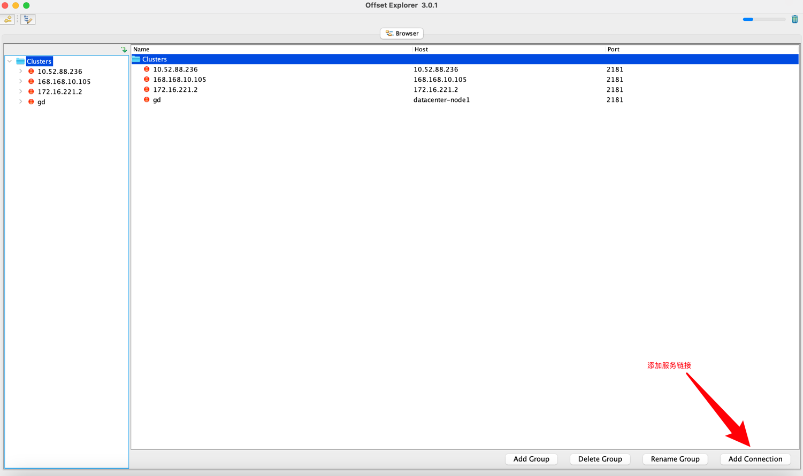
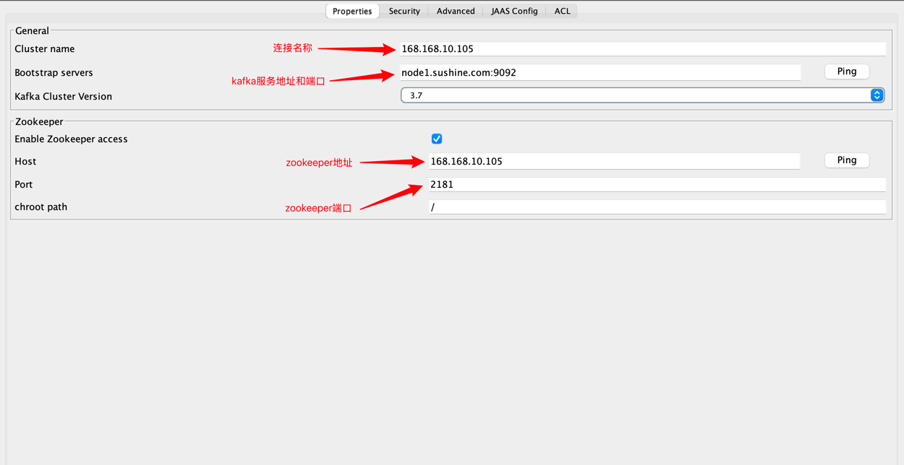
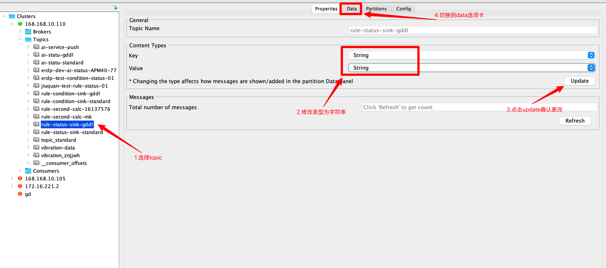
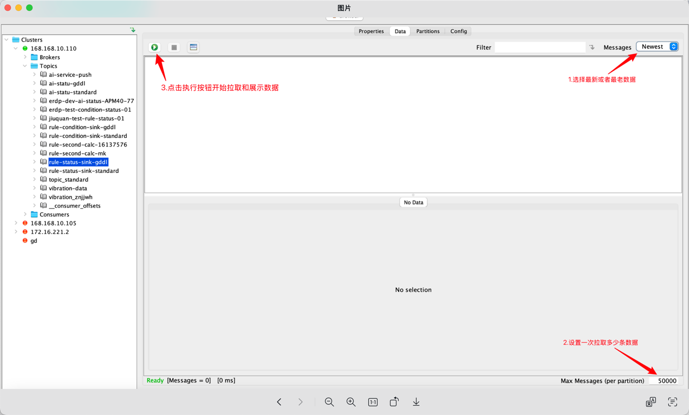
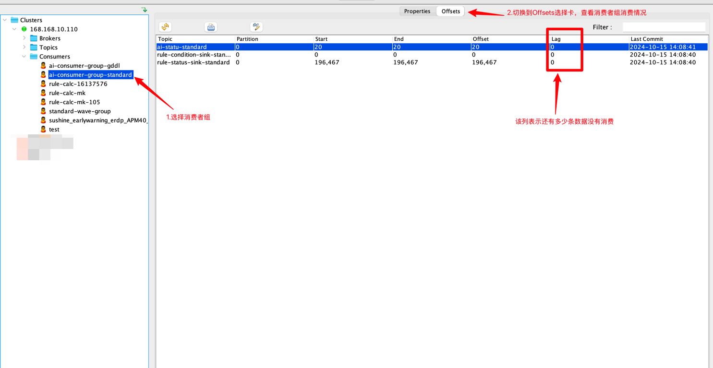

# kafka_demo
该项目介绍kafka如何部署和java使用
# kafka部署配置(单机模式部署)
## 1. 下载kafka
下载kafka压缩包，解压到任意目录，例如：/opt/kafka_2.13-3.7.1

**下载地址**: https://kafka.apache.org/downloads
## 2. 修改zookeeper配置文件
zookeeper是kafka依赖组件。kafka基于zookeeper作为服务注册中心，存储topic、消费者组等信息
```shell
vim /opt/kafka_2.13-3.7.1/config/zookeeper.properties
```
按需修改zookeeper端口号和数据目录
```properties
# 端口号
clientPort=2181
# 数据目录
dataDir=/opt/kafka_2.13-3.7.1/data
```
## 3. 修改kafka配置文件
```shell
vim /opt/kafka_2.13-3.7.1/config/server.properties
```
按需修改kafka端口号和数据目录
```properties
# 指定Kafka Broker实际监听的地址和端口，listeners 的格式通常是：协议名称://主机名或IP地址:端口，可以同时配置多个, 并且用逗号隔开。
listeners=PLAINTEXT://localhost:9092
# advertised.listeners配置，用于指定Kafka Broker对外暴露的地址和端口，默认和listeners配置一致，可以不配置，但建议配置，否则在网络隔离的情况下无法通信
advertised.listeners=PLAINTEXT://localhost:9092
# 数据目录
log.dirs=/opt/kafka_2.13-3.7.1/data/kafka-logs
```
## 4. 启动zookeeper服务
```shell
cd /opt/kafka_2.13-3.7.1/bin/
./bin/zookeeper-server-start.sh ./config/zookeeper.properties
```
## 5. 启动kafka服务
```shell
cd /opt/kafka_2.13-3.7.1/bin/
./bin/kafka-server-start.sh ./config/server.properties
```


# java使用kafka
## 1. 导入kafka依赖
```xml
<dependency>
    <groupId>org.apache.kafka</groupId>
    <artifactId>kafka-clients</artifactId>
    <version>3.4.1</version>
</dependency>
```
## 2. 生产者案例
```java
import org.apache.kafka.clients.producer.KafkaProducer;
import org.apache.kafka.clients.producer.ProducerConfig;
import org.apache.kafka.clients.producer.ProducerRecord;
import org.apache.kafka.common.serialization.StringSerializer;

import java.util.Properties;

/**
 * 以下是kafka消息生产案例
 */
public class ProductTest {
    public static void main(String[] args) {
        Properties props = new Properties();
        // 设置kafka服务地址
        props.put(ProducerConfig.BOOTSTRAP_SERVERS_CONFIG, "localhost:9092");
        // 设置key-value序列化器
        props.put(ProducerConfig.KEY_SERIALIZER_CLASS_CONFIG, StringSerializer.class.getName());
        props.put(ProducerConfig.VALUE_SERIALIZER_CLASS_CONFIG, StringSerializer.class.getName());

        // 创建生产对象
        KafkaProducer<String, String> producer = new KafkaProducer<>(props);
        // 发送消息
        producer.send(new ProducerRecord<>("test", "hello kafka"));
        producer.flush();
        producer.close();
    }
}
```

## 3. 消费者案例
```java
import org.apache.kafka.clients.consumer.ConsumerConfig;
import org.apache.kafka.clients.consumer.KafkaConsumer;
import org.apache.kafka.common.serialization.ByteArrayDeserializer;

import java.util.Arrays;
import java.util.Properties;

/**
 * 以下是kafka消息消费案例
 */
public class ConsumeTest {
    public static void main(String[] args) {
        Properties props = new Properties();
        // 设置kafka服务地址
        props.put(ConsumerConfig.BOOTSTRAP_SERVERS_CONFIG, "localhost:9092");
        // 指定消费者组（避免多节点同时消费一个topic的重复消费的问题）
        props.put(ConsumerConfig.GROUP_ID_CONFIG, "test");
        // 开启自动提交配置
        props.put(ConsumerConfig.ENABLE_AUTO_COMMIT_CONFIG, true);
        // 自动提交时间间隔
        props.put(ConsumerConfig.AUTO_COMMIT_INTERVAL_MS_CONFIG, 1000);

        // 心跳时间检测间隔
        props.put(ConsumerConfig.HEARTBEAT_INTERVAL_MS_CONFIG, 6000);
        // 消费者组失效超时时间
        props.put(ConsumerConfig.SESSION_TIMEOUT_MS_CONFIG, 28000);
        // 消费者组位移丢失和越界后恢复起始位置
        props.put(ConsumerConfig.AUTO_OFFSET_RESET_CONFIG, "latest");

        // 最大拉取时间间隔
        props.put(ConsumerConfig.MAX_POLL_INTERVAL_MS_CONFIG, 300000);
        // 一次最大拉取的量
        props.put(ConsumerConfig.MAX_POLL_RECORDS_CONFIG, 1000);

        // 设置key-value反序列化器
        props.put(ConsumerConfig.KEY_DESERIALIZER_CLASS_CONFIG, ByteArrayDeserializer.class.getName());
        props.put(ConsumerConfig.VALUE_DESERIALIZER_CLASS_CONFIG, ByteArrayDeserializer.class.getName());

        KafkaConsumer<byte[], byte[]> consumer = new KafkaConsumer(props);
        consumer.subscribe(Arrays.asList("test"));

        // 通过死循环持续消费消息
        while (true) {
            try {
                // 拉取数据
                // 这里的1000表示拉取超时时间，单位是毫秒，意思是等待1000毫秒，如果1000毫秒内没有拉取到数据就返回了
                consumer.poll(1000).forEach(record -> {
                    System.out.println("topic:" + record.topic()
                            + " partition:" + record.partition()
                            + " offset:" + record.offset()
                            + " key:" + new String(record.key())
                            + " value:" + new String(record.value()));
                    // 以下添加数据消费逻辑
                    // 需要注意的是，如果消费耗时大于配置的最大拉取时间间隔配置（）max.poll.interval.ms），会导致消费组下线，和重复消费

                });
                // 提交确认消费，如果未开启自动提交（ConsumerConfig.ENABLE_AUTO_COMMIT_CONFIG），需要手动提交确认消费
                // consumer.commitSync();
            }catch (Exception e){
                e.printStackTrace();
            }
        }
    }
}
```

# kafka可视化工具使用
## 1. 软件安装
[安装包位置](files/offsetexplorer)
## 2. 新建kafka 连接



## 3. 查看topic信息



## 4. 查看消费组信息



